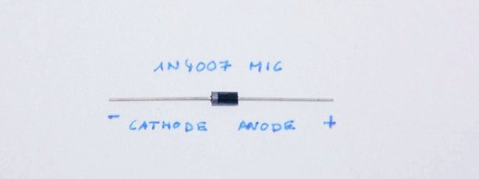

# Diode

_A Diode is a device passing current in one direction depending on the polarity
of the applied voltage._

Diodes are represented with following symbol in electronic schematics:

Diodes have a positive terminal (+) called **anode**, and a negative terminal (-)
called **cathode**. The arrowhead points against the direction of electron flow.
If a positive voltage is present on the anode (forward direction) then the diode
is "turned on", and allows current to flow through. In this mode the diode is
**forward biased**. (Most silicon based diodes required a positive threshold
voltage of 0.7V to turn on.)

If the voltage across the diode is negative, means that a negative voltage is
present at the anode, then no current will flow (like an open circuit). The diode
blocks the flow of current in reverse direction, hence is **reverse biased**.
The peek reverse voltage (PIC), or **breakdown voltage** specifies the maximum
reverse voltage level at which the diodes isolation function will break down and
current starts to flow in reverse direction.

### General-Purpose Diode

Following a picture of a semiconductor general-purpose diode from the 1N400x-series:

The **gray ring** (stripe mark) on the device indicates the side of the cathode.

### Measure Diodes with a Multimeter

Make sure your fingers don't touch the test points/leads, otherwise the skin
resistance will be measured.

- If the resistance is zero in both directions, then the diode is shorted.
- If the resistance is infinite in both directions, then the diode is open.
- If the resistance is infinite in one direction and a small resistance in the
  other direction (open circuit), then the diode is functional.

Knowing which is the positive lead of the multimeter allows to determine the
diodes cathode.

# Zener Diode

Designed to **conduct in reversed biased mode** in a controlled way

- The reverse voltage causing the diode to conduct is called the **zener voltage** (Vz).
- Vz is determined by the resistivity of the diode junction and ranges between 2.7V up to 200V
- Typical applications are voltage regulators.

# Light Emitting Diode (LED)

* Active electronic component that **produces light** when current flows through a crystal
* Different crystals produce colors like red, yellow, green, blue or white
* 2 leads: **Anode** (positive) & **Cathode** (negative)
  - **Polarised**: Connected to a circuit in one direction
  - Current needs to flow from anode to cathode (otherwise it dose not illuminate)
  - The **longer lead** (anode) goes to the more positive voltage
  - The **flat spot** on the LED indicates the cathode

* **Voltage drop**: Within a circuit voltage will change across the LED
  - Each color has a characteristic voltage drop, e.g. red ~1.7V
  - Each color uses a different semiconductor material to emit light of a specific wavelength
* LEDs are **current driven**:
  - Given the required voltage, the crystal in the LED starts to glow
  - Increased current will make LEDs brighter until it is eventually destroyed
  - Therefore current needs to be restricted by a resistor
* Applications:
  - Illumination in e.g. flashlights, TVs
  - Status indication in e.g. battery charger, car back light
* Brightness of an LED is measured in **Milli-Candela** (MCD), ranges from 10-5000 MCD

# RGB LED

A device with three internal LEDs of red, green, and blue (RGB) color

* These LEDs **combines three light spectra** to create a desired color spectrum.
* The RGB **additive color model** can be digitally represented with an integer number for each of the three colors.
* The color **triplets range from 0 to 255** per channel, the darkest color, black is `255,255,255` and the lightest color, white `0,0,0`.

