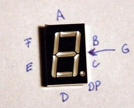

# Seven-Segment Display

Display device for decimal numerals 0-9

- The seven segments of the display can lit in different combinations to represent numerals
- The **digit segments** are referred to by letters **A-G**
- The **DP** (decimal point) segment is used to display non-integer numbers

Hexadecimal letter digits can be represented with a combination of upper- and lowercase: A,b,C,d,E,F

List of segment states (on/off) to display digits:

| Digit | ABCDEFG  |
|-------|----------|
| 0     | 1111110  |
| 1     | 0110000  |
| 2     | 1101101  |
| 3     | 1111001  |
| 4     | 0110011  |
| 5     | 1011011  |
| 6     | 1011111  |
| 7     | 1110000  |
| 8     | 1111111  |
| 9     | 1110011  |
| A     | 1110111  |
| b     | 0011111  |
| C     | 1001110  |
| d     | 0111101  |
| E     | 1001111  |
| F     | 1000111  |

Terminals for A-G, DP and the common cathode (ground):

_The display uses LEDs, therefore a current-limiting resistor is required!_

