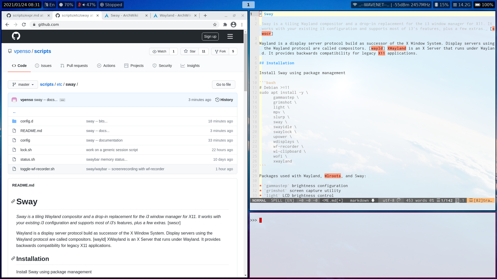

# Sway

_Sway is a tiling Wayland compositor and a drop-in replacement for the i3 window manager for X11. It works with your existing i3 configuration and supports most of i3's features, plus a few extras._ [swscr]

Wayland is a display server protocol build as successor of the X Window System. Display servers using the Wayland protocol are called compositors. [wayld] XWayland is an X Server that runs under Wayland. It provides backwards compatibility for legacy X11 applications.

The Sway configuration in this repository looks like the following screenshot:



## Installation

Install Sway using package management

```bash
# Debian >=11
sudo apt install -y \
      gammastep \
      grimshot \
      light \
      mpv \
      slurp \
      sway \
      swayidle \
      swaylock \
      upower \
      wdisplays \
      wf-recorder \
      wl-clipboard \
      wofi \
      xwayland
```

Packages used with Wayland, Wlroots, and Sway:

* `gammastep` brightness configuration
* `grimshot` screen capture utility
* `light` LCD brightness control
* `mpv` video playback
* `slurp` selects a region in Wayland
* `upower` power management used in `status.sh`
* `wdisplays` GUI output display manager
* `wl-clipboard` clipboard copy/paste

Start Sway:

```shell
# load the configuration manually
source $SCRIPTS/var/aliases/sway.sh
# start the window manager from the command-line
sway
```

## Configuration


Files                        | Description
-----------------------------|---------------------------------------
`config`                     | Sway configuration files includes `config.d/*`
`config.d/*`                 | Specific Sway configurations for components
`config.d/input`             | Keyboard layout configuration (US,DE)
`config.d/float`             | Move windows into the float area, apps. floating by default
`config.d/output`            | Background wallpaper configuration in `~/.cache/wallpaper`
`lock.sh`                    | `swaylock` script used in `config.d/keys`
[`var/aliases/sway.sh`][01]  | Load Sway configuration to the environment
[`var/cheat/sway.md`][04]    | Keyboard binding cheat sheet

Reload the configuration:

```shell
# from the commnad-line
swaymsg reload
```

Alternatively use a key binding **Super + Shift + C**.

### Status Line

Sway default status line `swaybar`

Files                        | Description
-----------------------------|---------------------------------------
`status.sh`                  | Status line script used by `swaybar`
`config.d/swaybar`           | Enable `swaybar` configuration

More customizable status line with `waybar` (replacing `swaybar`) 

Files                        | Description
-----------------------------|---------------------------------------
[`etc/waybar`][02]           | Configuration files
`config.d/waybar`            | Enable WayBar in Sway

### Applications

Screenshots with `grim`, `slurp` and `grimshot` [grim]:

Files                        | Description
-----------------------------|---------------------------------------
`config.d/grimshot`          | Key binding for `grimshot`

LCD back light configuration with `light`:


Files                        | Description
-----------------------------|---------------------------------------
`config.d/light`             | Key binding for function keys

Volume and microphone control with `pulseaudio`:

Files                        | Description
-----------------------------|---------------------------------------
`config.d/pulseaudio`        | Key binding to function keys

Screen recording with `wf-recorder`:

Files                        | Description
-----------------------------|---------------------------------------
`toggle-wf-recorder.sh`      | Help script to control `wf-recorder`
`config.d/wf-recorder`       | Key binding to enable/disable `wf-recorder`


Application launcher `wofi`:

Files                        | Description
-----------------------------|---------------------------------------
[`etc/wofi`][03]             | `wofi` configuration files
`config.d/wofi`              | Key binding for `wofi`

### References

[grims] Grim & Slurp Wayland tools for Screen Shots  
<https://wayland.emersion.fr/grim/>  
<https://wayland.emersion.fr/slurp/>  
<https://github.com/swaywm/sway/blob/master/contrib/grimshot>

[swscr] Sway Source Code Reository, GitHub  
<https://github.com/swaywm/sway>

[wayld] Wayland Display Server  
<https://wayland.freedesktop.org>
<https://wayland.freedesktop.org/xserver.html>

[01]: ../../var/aliases/sway.sh
[02]: ../waybar/
[03]: ../wofi/
[04]: ../../var/cheat/sway.md
