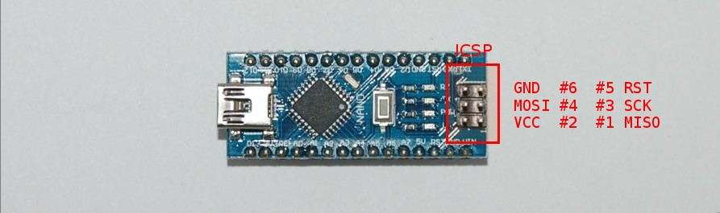
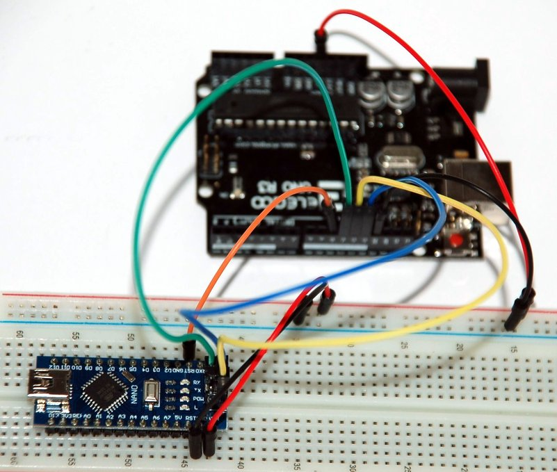

# Flash a Bootloader to an Arduino Nano

Use an Arduino Uno as AVR **ISP** (In-System Programmer) to burn a bootloader onto an Arduino Nano.

ICSP AVRtiny programming header pins:

The picture above highlight the ISP6PIN connector:

| Pin | Name       | Description                                |
|-----|------------|--------------------------------------------|
| #1  | **MISO**   | Data from target AVR to AVR ISP            |
| #2  | **VCC**    | Power                                      |
| #3  | **SCK**    | Serial Clock, controlled by AVR ISP        |
| #4  | **MOSI**   | Command & Data, from AVR ISP to target AVR |
| #5  | **RST**    | Reset, controlled by AVR ISP               |
| #6  | **GND**    | Ground                                     |

## Components & Connections

List of required components:

| Pcs. | Name      | Description |
|------|-----------|-------------|
| 1    | **UNO**   | Arduino UNO |
| 1    | **NANO**  | Arduino Nano|

List of connections:

| From            | To                 |
|-----------------|--------------------|
| UNO **D13**     | NANO **SCK**       |
| UNO **D12**     | NANO **MISO**      |
| UNO **D11**     | NANO **MOSI**      |
| UNO **D10**     | NANO **RST**       |
| UNO **5V**      | NANO **VIN**       |
| UNO **GND**     | NANO **GND**       |

## Procedure

Use the Arduino IDE:

* Upload the ISP to the Arduino UNO
  - Select File ➤ Examples ➤ Arduino ISP
  - Verify & Upload
* Burn the bootloader to the Arduino Nano
  - Select Tools ➤ Board ➤ Arduino Nano w/Atmega 328
  - Select Tools ➤ Programmer ➤ Arduino as ISP
  - Select Tools ➤ Burn Bootloader
