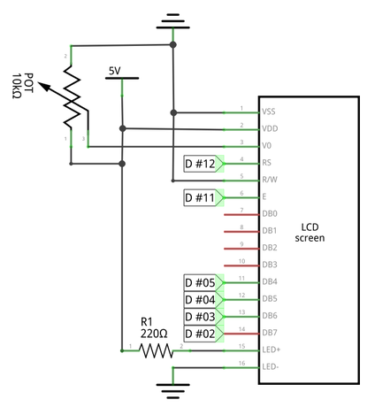
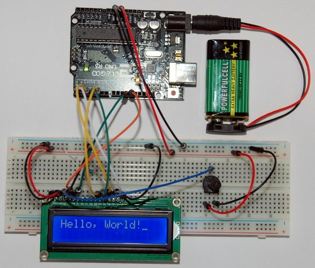

# Using an LCD 1602 Module

List of required components:

| Pcs. | Name     | Description                                   |
|------|----------|-----------------------------------------------|
| 1    | **LCD**  | 1602 LCD Module (with pin header)             |
| 1    | **POT**  | Potentiometer                                 |
| 1    | **R1**   | Resistor 220Ω                                 |



Connections on the breadboard and Arduino:

* Red wires to positive **5V**, black wires to ground **0V**
* LCD **VSS** terminal #1 → Ground **0V**
* LCD **VDD** terminal #2 → Positive **5V**
* LCD **VO** terminal #3 → POT **OUT** terminal #2
* LCD **RS** terminal #4 → Arduino **D12** (digital output) terminal #12
* LCD **RW** terminal #5 → Ground **0V**
* LCD **E** terminal #6 → Arduino **D11** (digital output) terminal #11
* LCD **D4** terminal #11 → Arduino **D5** (digital output) terminal #5
* LCD **D5** terminal #12 → Arduino **D4** (digital output) terminal #4
* LCD **D6** terminal #13 → Arduino **D3** (digital output) terminal #3
* LCD **D7** terminal #14 → Arduino **D2** (digital output) terminal #2
* LCD **A** terminal #15 → R1 Resistor 220Ω terminal #1
* LCD **K** terminal #16 → Ground **0V**
* POT **IN** terminal #1 → Positive **5V**
* POT **GND** terminal #3 → Ground **0V**
* R1 Resistor 220Ω terminal #2 → Positive **5V**

Following picture illustrates the setup including Arduino, and battery power supply:



## Code

The Arduino development environment provide a [LiquidCrystel](https://www.arduino.cc/en/Reference/LiquidCrystal) library to control LCD screens. In the following example a variable `lcd` is initialized and the LCD screen dimensions configured before printing a text:


```c
#include <LiquidCrystal.h> // library to control LCDs

/* Initialize the library with the pins connected to the LCD
 *
 * - Creates a variable of type LiquidCrystal called `lcd`
 * - Uses the register select pin RS and the enable signal pin E
 * - 4 pins used for data lines D4 up to D7
 */
LiquidCrystal lcd(12, 11, 5,  4,  3,  2 );
//                RS, E,  D4, D5, D6, D7

void setup() {
  // Configure the LCD screens dimensions (width/height)
  lcd.begin(16,2); // 16 characters by two lines
  // Print text to the screen
  lcd.print("...");
}

void loop() {}
```

The library provide multiple function to display and position content on the screen:

```c
[…]

const int sec = 1000;

void loop() {
  delay(sec);
  // Clear the screen
  lcd.clear();
  // Position the LCD cursor at the 10th column, in the second row
  lcd.setCursor(10,1);
  // Set the display to scroll automatically, by pushing previous
  // characters one column to the left
  lcd.autoscroll();
  int i;
  // Display the numbers 0 up to 9
  for(i = 0; i < 10; i++) {
    lcd.print(i);
    delay(sec);
  }
}
```
