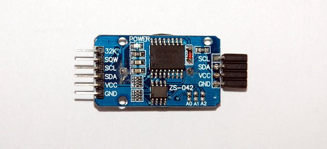

# ZS-042 DS3231 Real Time Clock



| Pin     | Description                      |
|---------|----------------------------------|
| VCC     | Power 2.3~5.5V                   |
| GND     | Ground 0V                        |
| SDA,SCL | I²C bus communication            |
| SQW     | Interrup signals                 |

## Setup

List of required components:

| Pcs.| Name    | Description       |
|-----|---------|-------------------|
| 1   | **UNO** | Arduino UNO MC    |
| 1   | **RTC** | ZS-043 RTC Module |

Connections on the breadboard and Arduino:

| From            | To                         |
|-----------------|----------------------------|
| RTC **VCC**     | UNO **5V**                 |
| RTC **GND**     | UNO **GND**                |
| RTC **SCL**     | UNO **A5** (analog in)     |
| RTC **SDA**     | UNO **A4** (analog in)     |

## Code

Find the [DS3231](http://www.rinkydinkelectronics.com/library.php?id=73) library
in the `lib/` directory. The following example sets/reads the clock module:

```c
#include <DS3231.h>

// Init the DS3231 using the hardware interface
DS3231  rtc(SDA, SCL);

void setup()
{
  // Setup Serial connection
  Serial.begin(9600);

  rtc.begin();

  // The following lines can be uncommented to set the date and time
  //rtc.setDOW(FRIDAY);     // Set Day-of-Week to SUNDAY
  //rtc.setTime(18, 12, 30);     // Set the time to 12:00:00 (24hr format)
  //rtc.setDate(14, 4, 2017);   // Set the date to January 1st, 2014
}

void loop()
{
  // Send Day-of-Week
  Serial.print(rtc.getDOWStr());
  Serial.print(" ");

  // Send date
  Serial.print(rtc.getDateStr());
  Serial.print(" -- ");

  // Send time
  Serial.println(rtc.getTimeStr());

  // Wait one second before repeating :)
  delay (1000);
}
```
