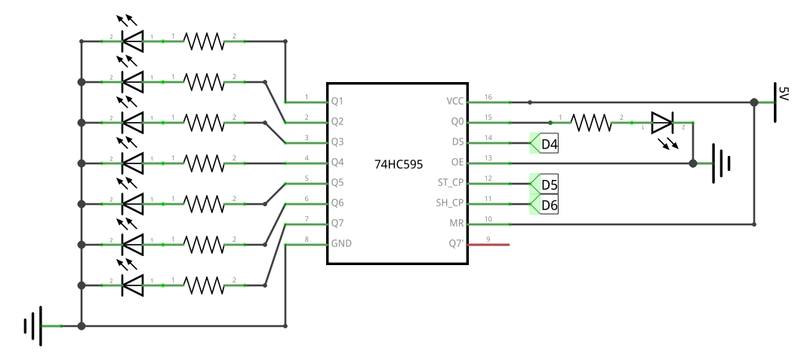
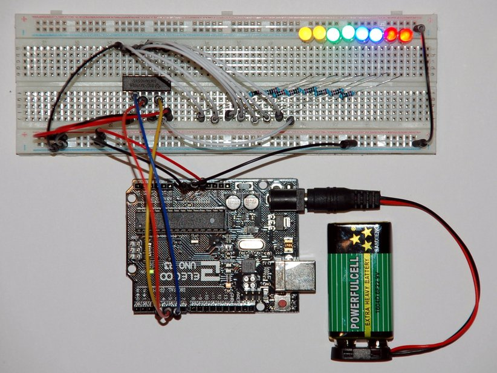

### Schematic

Three pins will be used to communicate with the micro-controller, and all data pins control an LED:

| Pin       | Name           | Connect to...                   | 
|-----------|----------------|---------------------------------|
| #[1-7,15] | **Q0-Q7**      | 220Ω resistorsa, and an LED     |
| #14       | **DS**         | Arduino **D4** (digital output) |
| #12       | **ST_CP**      | Arduino **D5** (digital output) |
| #11       | **SH_CP**      | Arduino **D6** (digital output) |
| #[8,13]   | **GND**,**OE** | **0V**                          |
| #[10,16]  | **MR**,**VCC** | **5V**                          |

### Breadboard

### Code

Implement following code, cf. [main.ino](main.ino):

1. Use a variable **leds** of type `byte` to represent the state of the 8 bits to control the LEDs.
2. Write a function **serialPrintByte()** using [Serial.print()](https://www.arduino.cc/en/serial/print) to write the bit state of the `leds` variable.
3. Use a for-loop and the function [bitSet()](https://www.arduino.cc/en/Reference/bitSet) to switch the individual bit on, one after another.
4. Write a function **txRegisterState()** using [shiftOut()](https://www.arduino.cc/en/Reference/ShiftOut) to feed the `leds` state to the shift register.
