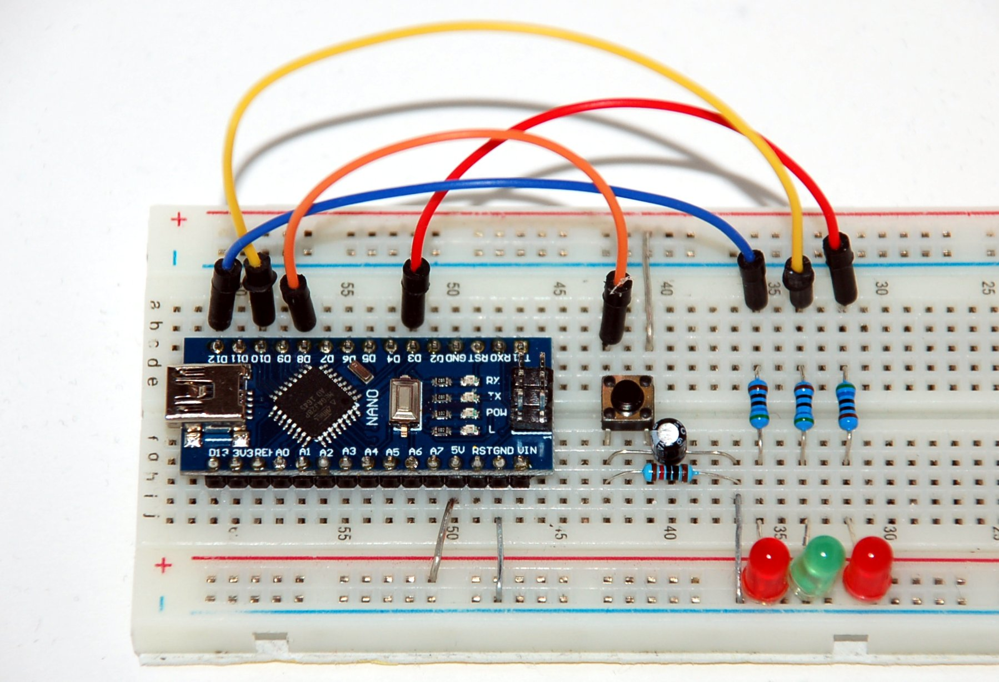

## Digital I/O

A push button controls the mode of LEDs (on/off):

- All LEDs starts to glow when the device is powered on.
- Pressing the button switches the LED on D12 off.

* Pins D[3,10,12] are each connected to ground (0V) via a resistor (300-600Ω) and an LED.
* Pin D8 is connected to the supply voltage (5V) over a simple push button.
* Optional: Connect the button with a debounce circuit using a 10kΩ resistor and a 100nF capacitor wired in parallel to ground (0V).
