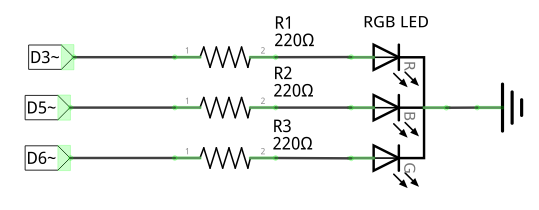
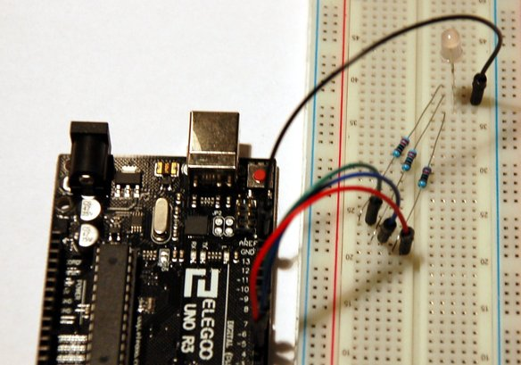

# Digital I/O with PWM

### Setup

The RGB LED has four leads, one for each color (positive), and a common ground (negative). Each LED color lead requires a protection resistor **R[1,2,3]** (e.g. 220Ω).

**Connections**

* **Red** lead → Arduino **D3** (digital output, with PWM)
* **Blue** lead → Arduino **D5** (digital output, with PWM)
* **Green** lead → Arduino **D6** (digital output, with PWM)
* Common ground → Arduino **GND** (0V)

### Code

**[main.ino](main.ino)** implements:

1. An `rgbColor()` function with arguments for each RGB color. It sends output to **D[3,5,6]** with [analogWrite()](https://www.arduino.cc/en/Reference/AnalogWrite)
2. Call this function from the main `loop()` to mix red, green, blue, yellow, purple, and aquamarine colors.
3. Write for-loops to iterate over all possible RGB colors.
