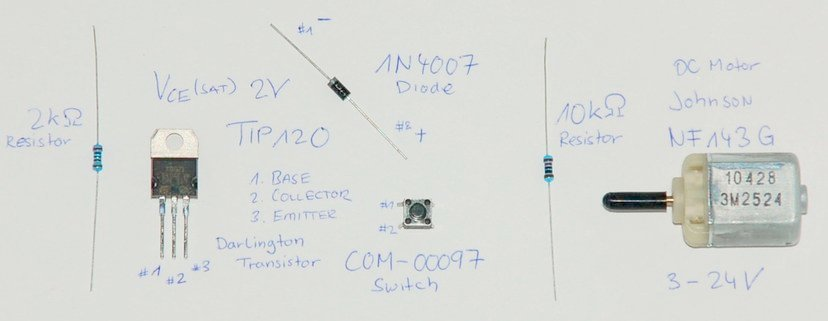
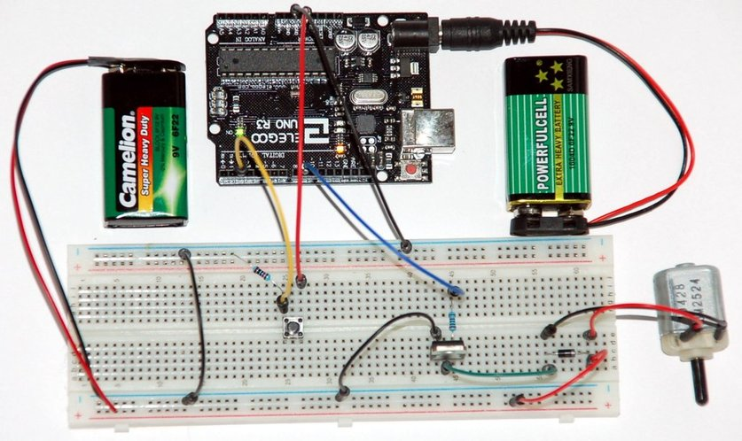

# Controlling a DC Motor

Even small DC motors can draw more current than the 40mA maximum provided by an Arduino UNO on a single GPIO pin. By using a Darlington Transistor it is possible to control a separate 9V battery power source for the motor able to provide much higher current.

The **base activation voltage** for a Darlington Transistor pair is the sum of 2 x 0.7V = **1.4V**. With a 2kΩ resistor at the base of the transistor the current drawn from the connected Arduino used to control the motor will be limited to approximate **1.8mA**.

    (5V-1.4V)/2000Ω = 1.8mA

The TIP120 NPN (121/122) are rated for voltages of at least 60V and a current up to 5A. This Darlington transistor pair acts like one transistor with a current gain of the product of both individual transistors. The data sheet states a **current gain** up to 1000. This is more than sufficient to drive a small DC motor.

## Components

List of required components:

| Pcs. | Name    | Description                                        |
|------|---------|----------------------------------------------------|
| 1    | **UNO** | Arduino UNO, digital pins **D#2** and **D#9**      |
| 1    | **M1**  | DC motor Johnson NF143G-10428                      |
| 1    | **TIP** | TIP120  Darlington Transistor **#1** base, **#2** collector, **#3** emitter |
| 1    | **D1**  | 1N4001 Diode collector **#1** (-) and anode **#2** (+) |
| 1    | **R1**  | Resistor 10kΩ                                      |
| 1    | **R2**  | Resistor 2kΩ                                       |
| 1    | **B1**  | COM-00097 push button (single pole, single throw)  |

## Setup

List of connections:

* Button **B1** terminal **#1** to **5V**
* Button **B1** terminal **#2** to the **R1** resistor terminal **#1**
* Button **B1** terminal **#2** to pin **D#2** on the Arduino **UNO**
* Resistor **R1** terminal **#2** to ground **GND**
* Transistor **TIP** base terminal **#1** to **R2** resistor terminal **#2**
* Resistor **R2** terminal **#2** to pin **D#9** on the Arduino **UNO**
* Transistor **TIP** collector terminal **#2** to diode **D1** collector
  (negative) terminal **#1**
* Transistor **TIP** emitter terminal **#3** to ground **GND**
* Diode **D1** anode (positive) terminal **#2** to **9V**
* Motor **M1** terminal **#1** to diode **D1** anode **#2**
* Motor **M1** terminal **#2** to diode **D1** collector **#1**

Connect the 9V battery (+/-) to the bottom breadboard power supply line, and connect 5V and GND pins from the Arduino UNO to the top breadboard power supply line. Connect ground of both breadboard supply lines.

## Code

## Measurement

|                              | Voltage Drop |
|------------------------------|--------------|
| **R2** resistor              | 3.02V        |
| **TIP** collector-base       | 1.34V        |
| **TIP** collector-emitter    | 0.64V        |
| **M1** motor                 | 7.81V        |

|                              | Current |
|------------------------------|---------|
| **TIP** base                 | 1.5mA   |
| **TIP** collector            | 15.02mA |

If the motor shaft is blocked (can not continue to rotate) the **stall current** peaks at 105.5mA at the **TIP** collector.
