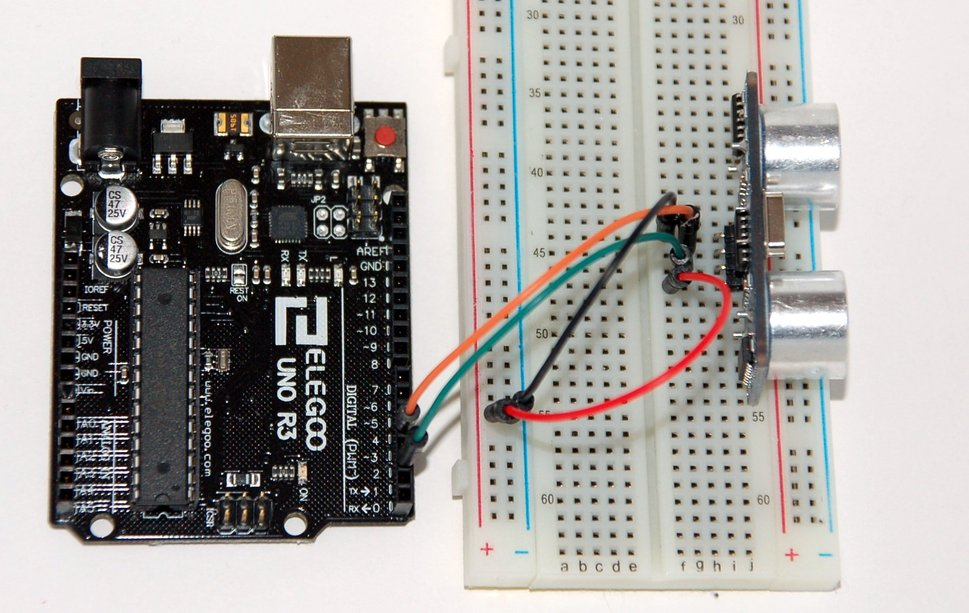

## Setup

Connections:

| From            | To                              |
|-----------------|---------------------------------|
| Sensor **Vcc**  | **+5V** DC                      |
| Sensor **Gnd**  | **0V**                          |
| Sensor **Trig** | Arduino **D2** (digital output) |
| Sensor **Echo** | Arduino **D4** (digital input)  |

Breadboard:



## Code

```c
const int baudrate = 9600;

const int triggerPin = 2;
const int echoPin = 4;

long duration;
int distance;

void setup() {
  // Enable Serial port with with defined bit-rate
  Serial.begin(baudrate);
  // On-board LED in output mode, and switched off
  pinMode(triggerPin,OUTPUT);
  pinMode(echoPin,INPUT);
}

void loop() {
  digitalWrite(triggerPin,LOW);
  delayMicroseconds(2);

  digitalWrite(triggerPin,HIGH);
  delayMicroseconds(10);
  digitalWrite(triggerPin,LOW);

  duration = pulseIn(echoPin,HIGH);
  distance = duration * 0.034 / 2;

  Serial.print("Distance: ");
  Serial.println(distance);

  delay(1000);
}
```
