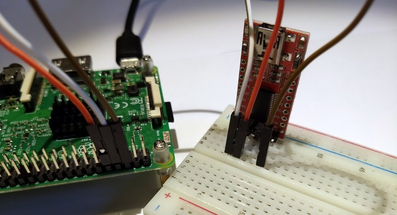

# FTDI

FTDI (Future Technology Devices International) 

* Develops and manufactures devices converting RS-232 or TTL serial transmissions to USB signals
* [FT232RL][02] **USB to UART** ASIC with 6-pin "FTDI header"


## Raspberry Pi 3 Mini UART

Uses`/dev/ttyS0` for Linux console output, cf. [UART on the Raspberry Pi][01]:

* Make sure to jumper the logic level to **3.3V** 
* Enable the Linux console by adding `enable_uart=1` in `/boot/config.txt`

Default UART GPIO pins:

Pin | Description
----|------------
6   | GND (ground)
8   | TX (transmit)
10  | RX (receive)



Open a terminal and use Screen to the FTDI adapter:

```bash
screen /dev/ttyUSB0 115200
# exit with ctrl-a K
```

[01]: https://www.raspberrypi.org/documentation/configuration/uart.md
[02]: https://www.ftdichip.com/Products/ICs/FT232R.htm
