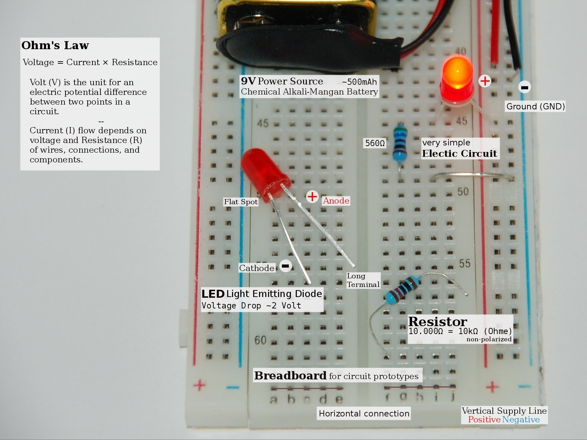

List of quantities, and their units as reference: 

| Quantity   | Symbol | Unit     | Abbr. | Description                                       |
|------------|--------|----------|-------|---------------------------------------------------|
| Voltage    | V      | Volt     | V     | Potential difference across an electric component |
| Current    | I      | Ampere   | A     | Current going through an electric object          |
| Resistance | R      | Ohms     | Ω     | Resistance of an electric object                  |
| Capacity   | C      | Amp-hour | Ah    | Battery capacity                                  |

## Ohm's Law

**Ohm’s law** describes the relation between voltage, current, and resistance:

    V = I × R        V (volts) = I (amps) × R (ohms)

Q1. _How would you arrange Ohm's law to solve for current intensity?_

    I = V ÷ R        I (amps)  = V (volts) ÷ R (ohms)

Q2. _How would you arrange Ohm's law to solve for resistance?_

    R = V ÷ I        R (ohms)  = V (volts) ÷ I (amps)

Q3. _If voltage increases while the resistance remains constant what would happen to the current intensity?_

The current intensity increases proportional to the voltage increase.

    R = 3.3V ÷   560Ω ≃ 0.0058A
          5V ÷   560Ω ≃ 0.0089A
          9V ÷   560Ω ≃ 0.0160A

Q4. _If the resistance in a circuit is increased without changing the **potential difference**, what would happen to the current intensity?_

The current intensity decreases proportional to the increase in resistance.

    I = 9V ÷   560Ω ≃ 0.0160A
        9V ÷  1000Ω = 0.0090A
        9V ÷ 10000Ω = 0.0009A

## Light Emitting Diode

[Light Emitting Diodes][06] (LEDs) are electronic semiconductor components producing light when current is applied.

Q1. _Explain why LEDs can only be connected in a specific direction within a circuit._

LEDs are polarized which means that current needs to flow from the anode (positive) to the cathode (negative). The longer terminal (anode) goes to the positive voltage. A flat spot on the LED indicates the cathode terminal required to be connected to ground.

Q2. _What is the [voltage drop][07] and current rating for standard LEDs?_

Standard LEDs are rated for currents up to 20mA with a voltage of: 

| Color                 | Volt     |
|-----------------------|----------|
| red, orange, yellow   | 1.9-2.2V |
| green, blue           | 3.0-3.4V |
| white, violet, purple | 2.9-4.2V |

## Resistor

The formula to [calculate the correct resistance][06] is:

    R = (Vₛ - Vₗ) ÷ I

Where Vₛ is the voltage source and Vₗ is the voltage drop of the LED.

Q1. _Given a standard through-hole red LED with a voltage drop of 2V, and a 9V battery. What resistance is required in the circuit to limit the current at the LED to 20mA?_

    R = (9V - 2V) ÷ (20mA × 1000) = 350Ω 

Q2. _Through-hole [resistors][04] use color bands to indicate their resistive value and tolerance. Explain the 4- and 5-color-band systems._

The band-system uses colored rings that encircle the body of the resistor. 

- The 4-band system uses four colored rings: digit, digit, multiplier, and tolerance
- The 5-band system uses five colored rings: digit, digit, digit, multiplier, and tolerance

| Color  | Digit | Multiplier | Tolerance |
|--------|-------|------------|-----------|
| Black  | 0     | 1          |           |
| Brown  | 1     | 10         | ± 1%      |
| Red    | 2     | 100        | ± 2%      |
| Orange | 3     | 1,000      |           |
| Yellow | 4     | 10,000     |           |
| Green  | 5     | 100,000    | ± 0.5%    |
| Blue   | 6     | 1,000,000  | ± 0.25%   |
| Violet | 7     | 10,000,000 | ± 0.1%    |
| Grey   | 8     |            |           |
| White  | 9     |            |           |
| Gold   |       | 0.1        | ± 5%      |
| Silver |       | 0.01       | ± 10%     |
| None   |       |            | ± 20%     |

Typically the space between the multiplier and the tolerance is bigger. Hence the color band first digit is on the opposite side.

Q3. _What 5-band colors have resistors with 560Ω, 220Ω, 10kΩ and a tolerance of ±1%?_

560Ω = Green, Blue, Black, Black, Brown  
220Ω = Red, Red, Black, Black, Brown  
10kΩ = Brown, Black, Black, Red, Brown
 

## Battery

Batteries have a electric specification i.e. an Alkaline [9V battery][05] has a 9V nominal voltage, and a capacity of 565mAh.

Battery capacity is simply the product of current (I) multiplied by time (T) in hours:

    C = I × T        C (amp-hours) = I (amps) × T (hours)

Q1. _How would you arrange the equation to solve for time?_

    T = C ÷ I        T (hours) = C (amp-hours) ÷ I (amps)

Q2. _Given a 9V battery with a capacity of 500mAh, and a load of 0.012A. How long can the battery support this load?_

    T = (500mAh ÷ 1000) ÷ 0.012A ≃ 41h

[04]: https://en.m.wikipedia.org/wiki/Resistors
[05]: https://en.m.wikipedia.org/wiki/Nine-volt_battery
[06]: https://en.m.wikipedia.org/wiki/LED_circuit
[07]: https://en.m.wikipedia.org/wiki/Voltage_drop
