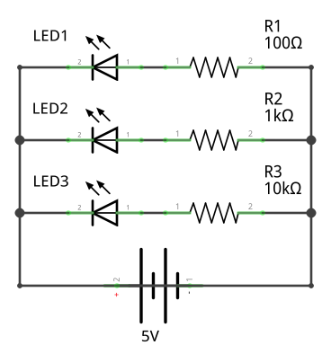
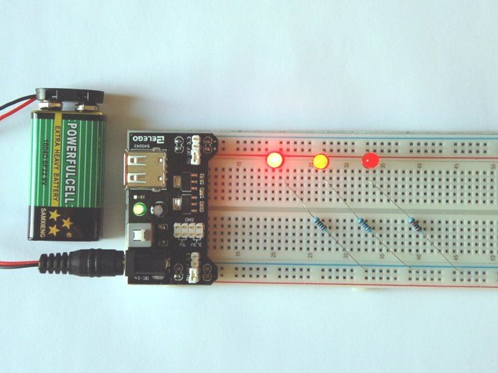
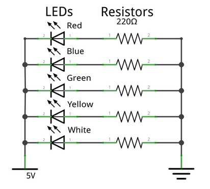
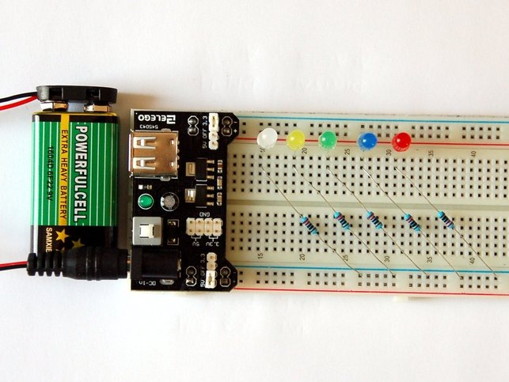
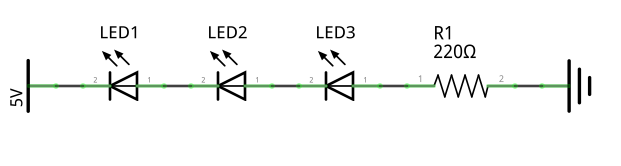

⇒ [Electricity](../../electricity.md)  
⇒ [Electric Circuit](../../electric_circuit.md)  
⇒ [Light Emitting Diodes](../../components/diode.md)  
⇒ [Resistors](../../components/resistor.md)  

# Resistors Influence on LED brightness

* Basic red LED features:
  - Voltage drop between 1.63V and 2.03V
  - Maximum current of 20mA (0.02A), suggested using current 16-18mA
* Apply Ohm's Law R = V/I 
  - Based on a 5V power source (5V-2V)/0.02A 
  - Requires a 150Ω resistor, to properly limit current 
* Calculate the current with different resistors **I = V/R**

| Resistor | Current                              |
|----------|--------------------------------------|
| 100Ω     | (5V-2V)/100Ω = **0.03A** (30mA)      |
| 1kΩ      | (5V-2V)/1000Ω = **0.003A** (3mA)      |
| 10kΩ     | (5V-2V)/100000Ω = **0.0003A** (0.3mA) |

**Increased resistance → decreased current → decreased brightness**

### Parallel Circuit with three Resistors

* Simple **electric circuit** in the following schematic
  - Three similar red LEDs
  - Three different resistors **R1** with 100Ω, **R2** with 1000Ω (1kΩ), and **R3** with 10000Ω (10kΩ)
* **Power source** on the bottom with positive **5V**, and negative ground with **0V**

* LED anodes **+** → **5V** power source
* LED cathode **-** → resistors **R[1-3]**
* _Resistors are **non-polarized**: Insert in both directions into the circuit_
* Resistors second lead → ground **0V**
* _It is possible to place the resistors on both sides of the LED_

### Breadboard Setup and Measurement

* **Breadboard** allows to build circuits for testing with **plug connections**
* Breadboard setup in the following picture:
  - Power source on the left,  battery block feeds 9V → circuit board connected on top
  - Circuit board powers → red (positive), and blue (negative) **horizontal supply lines**, top/bottom of breadboard. 
  - Circuit board configured to feed **5V** to red supply line 

* LED anodes **+** → red/positive supply line
* **Component area** in the middle segment on the breadboard 
  - _Between the supply lines_
  - **Vertical contact** allows electrical connections between components
* _Resistors require a connection to the same vertical column with their corresponding LED_ 
* Second lead of each resistor → ground, the blue supply line.

Measured voltage drop and current draw:

| Resistors | Voltage Drop | Current Draw |
|-----------|--------------|--------------|
| 100Ω      | 2.05V        | 28.1mA       |
| 1000Ω     | 1.94V        |  3.0mA       |
| 10000Ω    | 1.75V        |  0.3mA       |

# Voltage Drop for Different LED Colors

* Schematics for a circuit with **five LEDs**, red, blue, green, yellow, and white
  - Each color should have an individual voltage drop depending on its color
  - Five 220Ω resistors, one for each LED 

* LEDs anodes **+** → **5V**
* LEDs cathode **-** → 220Ω resistors
* Resistor → **0V** (ground)

### Breadboard Setup and Measurement

Measured the voltage drop and current draw:

| LED Color | Voltage Drop | Current |
|-----------|--------------|---------|
| Red | 1.99V | 12.9mA |
| Blue | 2.91V | 9.1mA |
| Green | 2.98V | 8.8mA |
| Yellow | 2.09V | 12.8mA |
| White | 2.98V | 8.9mA |

# Connecting LEDs in Series

* LEDs illuminate if the combined voltage drop across all is less than the supply voltage
  - Minimum voltage drop for a red LED is 1.63V * 3 = 4.98V
  * Use a voltage source with positive **5V**
- Connect the LED in series, anode to cathode 
- **One resistor** in the circuit,  e.g. 10Ω, or 220Ω, or 10kΩ

| Resistor | Voltage Drop | Current |
|----------|--------------|---------|
| 10kΩ     | 3x 1.59V     | 0.134A  |
| 220Ω     | 3x 1.64V     | 0.221mA |
| 10Ω      | 3x 1.64V     | 0.362mA |

