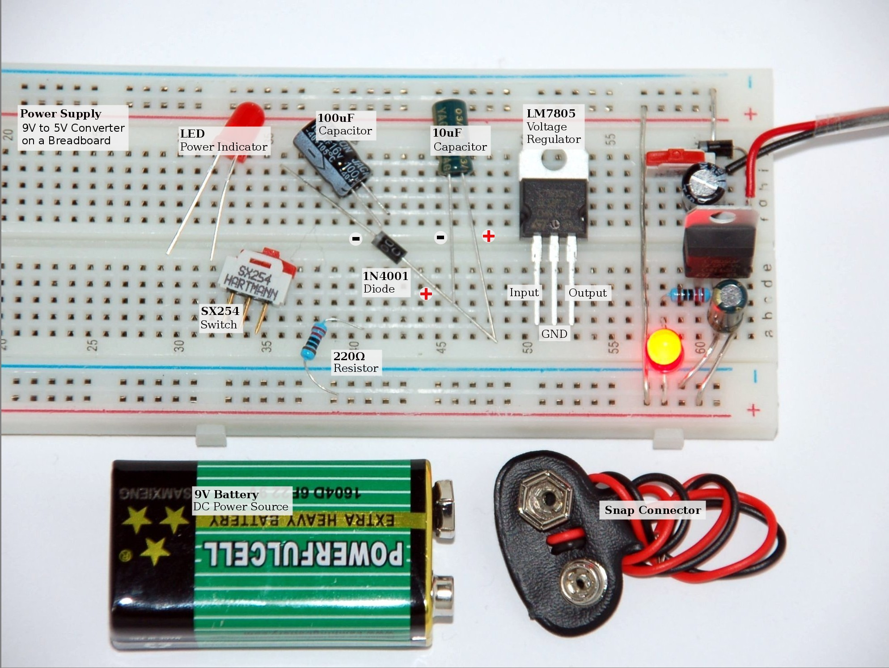
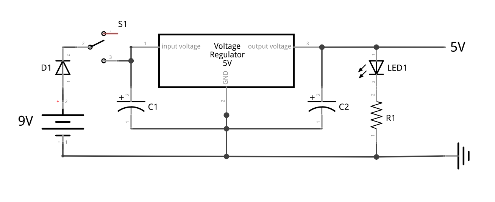

# Battery Power Supply

The picture above shows all components required to build a small 9V to 5V voltage converter used as power supply for prototyping breadboard. On the right side you can see the assembled circuit nicely fitted into five horizontal rows. In this setup 5V is provided to both top and bottom power supply lines of the breadboard.

List of required components:

| Pcs. | Name     | Description                    |
|------|----------|--------------------------------|
| 1    | **LM**   | LM7805 Voltage Regulator       |
| 1    | **C1**   | 100μF Capacitor (electrolytic) |
| 1    | **C2**   | 10μF Capacitor (electrolytic)  |
| 1    | **LED1** | LED (red)                      |
| 1    | **R1**   | 220Ω Resistor                  |
| 1    | **S1**   | Switch                         |
| 1    | **D1**   | 1N4001 Diode                   |
| 1    |          | 9V Block Battery               |
| 1    |          | 9V Battery Snap Connector      |

Following electronic schematic shows the power supply circuit:

