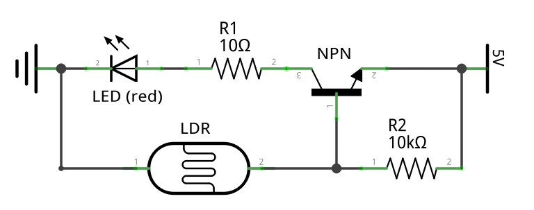

_Use an LDR and an NPN transistor to automatically switch on an LED in darkness._

### Components 

List of required components:

* 1× **LDP** light dependent resistor 
* 1× **NPN** transistor
* 1× **R1** resistor with 10Ω
* 1× **R2** resistor with 10kΩ
* 1× **LED** (red)

The LDR has following measured resistances:

| Light    | Resistance | Voltage |
|----------|------------|---------|
| Daylight | **1.2kΩ**  | 0.91V   |
| Darkness | **16kΩ**   | 3.16V   |

In darkness the LDR has **high resistance**, hence applies a voltage above the threshold to the transistors base. This switches the transistor **On**, and current flows from collector to emitter.

The following schematic shows the electric circuit with all components:

### Breadboard Setup

Connections:

* Red wires to positive **5V**, black wires to ground **0V**
* Transistor base **B** terminal #1 (39) → LDR terminal #1
* LDR terminal #2 → ground **0V**
* Transistor base **B** terminal #1 (39) → Resistor R2 (10kΩ) terminal #1 
* Resistor R2 (10kΩ) terminal #2 → **5V**
* Transistor emitter **E** terminal #2 (41) → **5V**
* Transistor collector **C** terminal #3 (37) → Resistor R1 (10Ω) terminal #1
* Resistor R1 (10Ω) terminal #2 → LED (red) anode **+** #1 
* LED cathode **-** terminal #2 →  ground **0V** 

