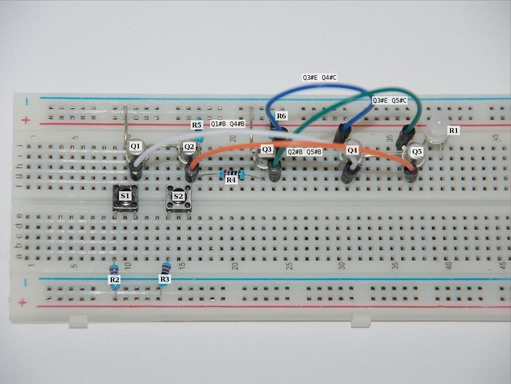

# XOR Logic Gate

The picture above shows five transistors used ti implement the **exclusive or** (XOR) logical operation that lights the LED only if one of the switches is presses.

List of required components:

| Pcs. | Name       | Description                |
|------|------------|----------------------------|
| 5    | **Q[1-5]** | PN2222 BJP NPN Transistor  |
| 6    | **R[1-6]** | 220Ω Resistor              |
| 2    | **S[1,2]** | COM-00097 Switch           |
| 1    | **LED**    | LED (red)                  |

Following electronic schematic show the XOR-gate:

Q1. _Show the truth table for an XOR gate?_

| S1 | S2 | LED |
|----|----|-----|
| 0  | 0  | 0   |
| 1  | 0  | 1   |
| 0  | 1  | 1   |
| 1  | 1  | 0   |

(0 = false; 1 = true )

Q2. _Write down the result for the following binary operation: 1110110100₂ XOR 1001001111₂_

    0111111011
