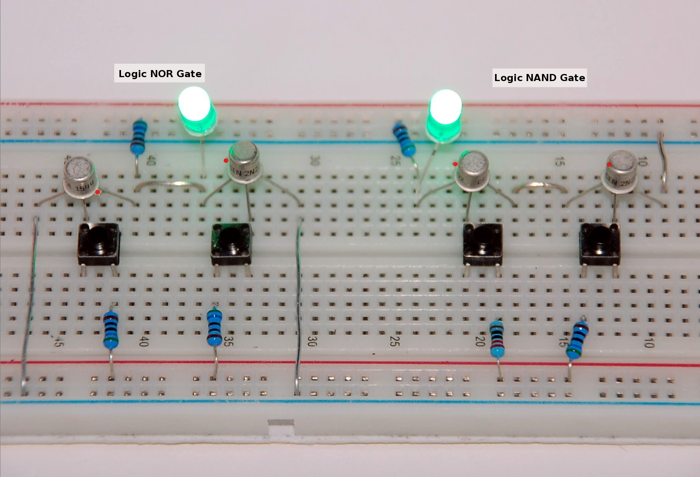
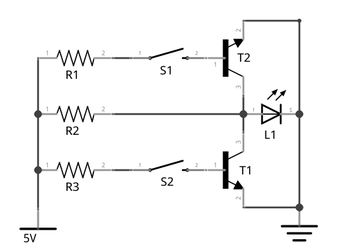
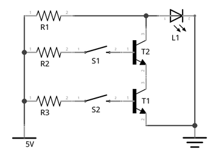

List of required components:

| Pcs. | Name     | Description             |
|------|----------|-------------------------|
| 2    | T[1,2]   | 2222 BJP NPN Transistor |
| 3    | R[1-3]   | 560Ω Resistor           |
| 2    | S[1,2]   | COM-00097 Switch        |
| 1    | L1       | LED (green)             |

## Logic NOR Gate

Truth Table:

| A | B | Q |
|---|---|---|
| 0 | 0 | 1 |
| 1 | 0 | 0 |
| 0 | 1 | 0 |
| 1 | 1 | 0 |

→ [Logic NOR Gate Tutorial](http://www.electronics-tutorials.ws/logic/logic_6.html)

## Logic NAND Gate

Truth Table:

| A | B | Q |
|---|---|---|
| 0 | 0 | 1 |
| 1 | 0 | 1 |
| 0 | 1 | 1 |
| 1 | 1 | 0 |

[Logic NAND Gate Tutorial](http://www.electronics-tutorials.ws/logic/logic_5.html)
