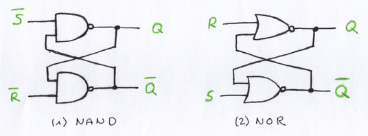
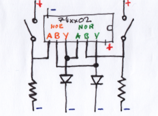
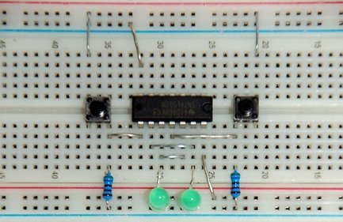
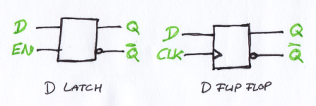
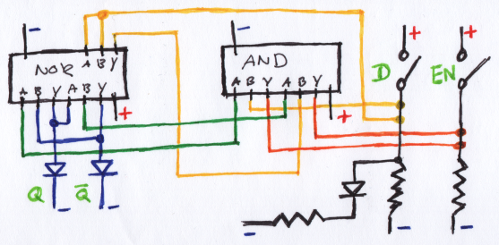
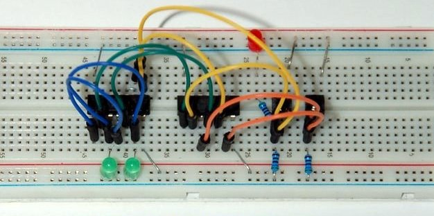
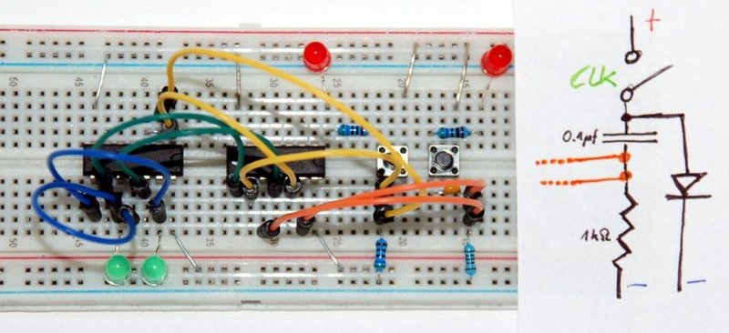

# Flip Flops

Flip-flops are bi-stable (two state) devices:

* Most basic type of 1-bit memory.
* The internal state is "remembered" until changed by an input pulse, or until the power is removed.
* Different types of flip-flops are build from combinations of logic gates.
* Also called bi-stable **Latch**. 

## SR/RS Type

SR (Set-Reset) flip-flop is one of the simplest sequential circuits:

* Two inputs **Set** (S) and **Reset** (R), and two outputs (Q, and negated Q).
* Output set in one of two states, and will remain **latched** indefinitely.

Schematic for an SR Flip-Flop and an RS Latch:

Build from to NAND/NOR gates:

* The output of each gate is connected to an input of the other gate (feedback loop, cross-coupling)
* (1) Low-activated SR Flip-Flop ("NOT" indicated by the bar above the letter)
* (2) High-activated RS Latch

List of required components to build an RS Latch with a breadboard:

| Pcs. | Description                   |
|------|-------------------------------|
| 1    | 74xx02 Quad 2 input NOR Gates |
| 2    | COM-00097 Switch              |
| 2    | 560Ω Resistor                 |
| 2    | LED (green)                   |

Schematic:

Setup on a breadboard:

Truth table for an RS Latch:

| S | R | Q | !Q | Comment                                                          |
|---|---|---|----|------------------------------------------------------------------|
| 0 | 1 | 1 | 0  | (a) Q is set to 1 by 1 on S                                      |
| 0 | 0 | 1 | 0  | (b) no change after set                                          |
| 1 | 0 | 0 | 1  | (c) Q is rest to 0 by 1 on R                                     |
| 0 | 0 | 0 | 1  | (d) no change after reset                                        |
| 1 | 1 | 0 | 0  | (e) not allowed (both outputs at zero)                           |
| 0 | 0 | ? | ?  | (f) if both inputs change from 11 to 00, output is indeterminate |

→ [Datasheet SN74LS02N](http://www.ti.com/lit/ds/symlink/sn74ls02.pdf), Texas Instruments  
→ [SR Latch](https://www.youtube.com/watch?v=KM0DdEaY5sY), Ben Eater  
→ [Sequential Logic Circuits](http://www.electronics-tutorials.ws/sequential/seq_1.html)  

# D Type

Circuit symbols for D type devices:

## D Latch

A D latch is like an RS latch with only one input: 

* Overcomes the drawbacks of the SR/RS type devices (e,f).
* Does not respond to a data input **D** unless the enable input **EN** is 1.
* While the circuit is enabled the D input sets the outputs **Q**, and de-activating the D input resets the circuit.
* If the circuit is not enabled then the Q  outputs stay latched, unresponsive to the state of the D input.

List of required components to build a D Latch:

| Pcs. | Description                   |
|------|-------------------------------|
| 1    | 74xx02 Quad 2 input NOR Gates |
| 1    | 74xx08 Quad 2 input AND Gates |
| 2    | COM-00097 Switch              |
| 3    | 560Ω Resistor                 |
| 3    | LED (green/red)               |

Hand drawn schematic:

Setup on a breadboard:

Truth table:

| EN | D | Q     | !Q    |
|----|---|-------|-------|
| 0  | 0 | latch | latch |
| 0  | 1 | latch | latch |
| 1  | 0 | 0     | 1     |
| 1  | 1 | 1     | 0     |

→ [Datasheet SN74LS08N](http://www.ti.com/lit/ds/symlink/sn74s08.pdf), Texas Instruments  
→ [D Latch](https://www.youtube.com/watch?v=peCh_859q7Q), Ben Eater  
→ [Gated D Latch](https://en.m.wikipedia.org/wiki/Flip-flop_(electronics)#Gated_D_latch), Wikipedia

## D Flip-Flop

List of additional components for the clock input **CLK**:

| Pcs. | Description                   |
|------|-------------------------------|
| 1    | 1µf ceramic capacitor         |
| 1    | 1kΩ resistor                  |

Setup on a breadboard, and a schematic for to modify the EN input to become **CLK**:

→ [D Flip Flop](https://www.youtube.com/watch?v=YW-_GkUguMM), Ben Eater  
