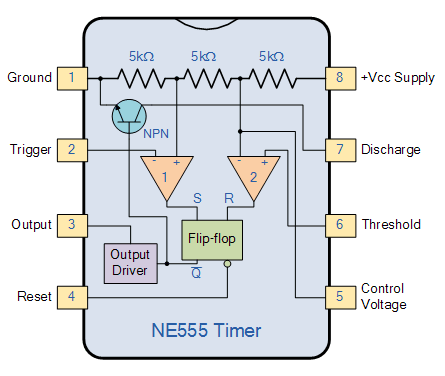
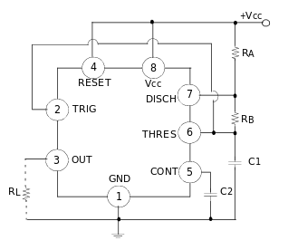

# 555 Timer Oscillator

Three internal 5k Ohm resistors generate two comparator reference voltages:

* Comparators produce an output dependent upon the voltage difference at inputs

* Ground (pin 1)
* Trigger (pin 2)
  - Negative input to the **comparator No. 1**
  - Sets internal Flip-flop at 1/3 Vcc
  - Output switch from LOW to HIGH
* Output (pin 3) Vcc - 1.5V
* Reset (pin 4)
  - Resets internal Flip-flop
  - Active low input, **`HIGH` if not used**
* Control Voltage (pin 5)
  - Overwrites the 2/3 Vcc level
  - Connect to **ground with a 10nf capacitor**
* Threshold (pin 6)
  - Positive input to **comparator No. 2**
  - Resets internal Flip-flop if exceeds 2/3 of Vcc
  - Output switch from HIGH to LOW
* Discharge (pin 7)
  - Used to discharge the **timing capacitor** when Output switches to LOW
* Supply voltage (Vcc) 4.5V to 15V

### Astable

Connect two resistors and a capacitor at the inputs to generate a fixed 
pulse train with a time period determined by the time constant of the RC network.

* TRIG and THRES pins connected to self-trigger (ops. as multi vibrator)
* While timer OUT high 
  - Internal discharge `Tr` turns off
  - Voltage at capacitor `C1` increases
  - `T = 0.693 * (RA + RB) * C1`
  - If THRES voltage exceeds 2/3 of supply voltage timer OUT low
* While timer OUT low
  - Internal discharge `Tr` turn on, and C1 discharges

