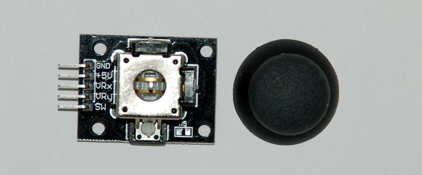

## JoyStick

Analog **two-axis** sensor with **push button** function.

- Similar in function to analog joysticks found in gamepads (e.g. Sony PS2).
- Push function actuated when the joystick is pressed.



Connectors:

| Pins | Number | Description                                        |
|------|--------|----------------------------------------------------|
| GND  | #1     | Ground 0V                                          |
| +5V  | #2     | Power, 5V DC                                       |
| VRx  | #3     | Analog X-axis, voltage proportional to x position  |
| VRy  | #4     | Analog Y-axis, voltage proportional to y position  |
| SW   | #5     | Digital switch, push button function               |

- Directional movement for each axis build with potentiometers (~10kΩ).
- The two potentiometers are mounted with a 90 degree angel and connected to a stick in the middle
- Moving the stick will case the analog signal to vary between 0V and 5V (resting position 2.5V)
- Reading the analog signal with a micro-controller will provide values between 0 and 1023 (resting position 512)

## Ultrasonic Sensor

**HC-SR04** ultrasonic ranging sensor:

- Determine the distance of an object using ultrasonic sound, hence with a non-contact range detection.
- The device is build with distinct ultrasonic transmitter and receiver modules.


Connectors:

| Pins | Description                |
|------|----------------------------|
| Vcc  | Power **+5V** DC  (15mA)   |
| Trig | Trigger (input)            |
| Echo | Receiver (output)          |
| Gnd  | Ground **0V**              |

Measuring angel 30° with a ranging distance of 2-400cm and a resolution up to 3mm.

## Temperature & Humidity

**DHT11**  temperature and humidity sensor module:


| Pin | Name | Description                                  |
|-----|------|----------------------------------------------|
| #1  | DATA | I/O port for the micro-controller            |
| #2  | VCC  | Power **+3.3~5V**                            |
| #3  | GND  | Ground 0V                                    |

Features:

* On module 10k Ohm pull up resistor
* Humidity 20-90%RH (+-5%RH), resolution 1%RH
* Temperature 0~50℃ (+-2℃), resolution 1℃

Supported in the Adafruit [DHT library](https://github.com/adafruit/DHT-sensor-library) for Arduino

### Serial communication

* Single wire two-way
* DATA pin is high by default
* **Start Signal**
  - Pull down the DATA pin for at leas 18ms to start communication
  - Pull up DATA pin for 20-40us to wait DHT11 response
* **Response Signal**
  - DHT11 pulls down data pin for 80us
  - Followed by a pull up of 80us
* **Transmission Process**
  - Each bit begins with 50us low-voltage-level
  - Ends with high-voltage low-voltage-level
  - Length of high-voltage-level signal "0" 26-28us, "1" 70us

### Data Transmission

40bit (higher data bit first)

1. 8bit integral RH data +
2. 8bit decimal RH data +
3. 8bit integral T data +
4. 8bit decimal T data +
5. 8bit check sum.

```
checksum = 8bit integral RH data
         + 8bit decimal RH data
         + 8bit integral T data
         + 8bit decimal T data
```
